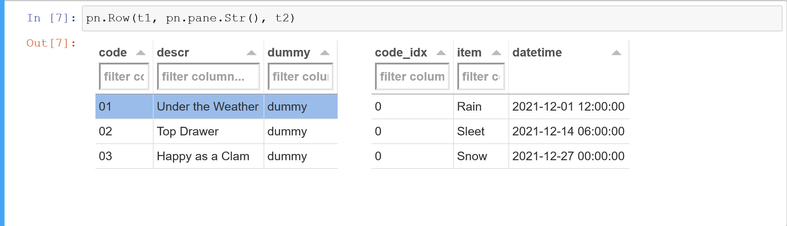

## A GoldenTemplate issue?
Linked Tabulators with hidden columns show no headers within GoldenTemplate tabs, even though they are visible in the Jupyter notebook. Is this an issue with the GoldenTemplate layout itself? Or an initialisation / synchronisation problem with how the Tabulators are created and linked in my code?


## MRE
A minimal reproducible example is contained in the [GTI-all-in-one notebook](GTI-all-in-one.ipynb), with screenshots of the resulting GoldenTemplate tabs and notebook cell shown below. Cell #3 controls whether or not the Tabulators are created with hidden columns. Note that a Tabulator row selection was made before taking the notebook screenshots, but not before taking the GoldenLayout screenshots.


### Hide some columns (`hide_columns=True`)
No Tabulator headers are visible in the GoldenLayout tabs.

 


### Show all columns (`hide_columns=False`)
In the GoldenLayout tabs the columns below the headers are not aligned with the headers.

 



### Software version info
conda environment.yml:
```yml
name: gti
channels:
  - pyviz/label/dev
  - defaults
dependencies:
  - python=3.9
  - panel=0.13.0a31
  - notebook
  - pandas
  - openpyxl
```
