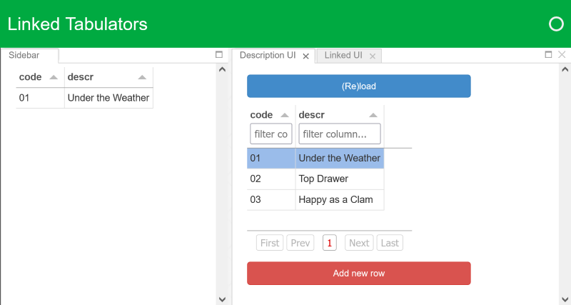

## A GoldenTemplate issue?
A linked Tabulator with hidden columns, which renders perfectly in a stand-alone Jupyter notebook, has no headers when viewed in a separate tab within a GoldenTemplate layout. Is this an issue with the GoldenTemplate layout itself? Or an initialisation / synchronisation problem with how the Tabulators are created and linked in my code?


### Aim
Two main Tabulator widgets, each with hidden columns, appear in separate tabs of a GoldenLayout template. A third Tabulator displays the current selection in the first Tabulator and appears in both the second tab and the sidebar. Selecting a row in the first Tabultor should update the data in the second and third linked Tabulators.

A new row can be added to the first Tabulator by clicking the button *iff* the header filters contain texts which match zero lines in the table.


### Observed appearance
 

Note that the table headers are missing from the Linked UI tab (right-hand image).

<details>

The above screenshots show the GoldenLayout app after either:
  * running the whole [GTI-UI-App notebook](./GTI-UI-App.ipynb) using `Cell > Run All`; or
  * running the first 4 cells after uncommenting the `hidden_columns=[...]` lines in the `gti.apps` sub-package:
    * [descr.py: line 28](https://github.com/grelston/GoldenTemplate-issue/blob/main/gti/apps/descr.py#L28)
    * [linked.py: line 23](https://github.com/grelston/GoldenTemplate-issue/blob/main/gti/apps/linked.py#L23)
    * [linked.py: line 37](https://github.com/grelston/GoldenTemplate-issue/blob/main/gti/apps/linked.py#L37)

</details>

 

Note that the table headers are not aligned to the table data (for both tables) in the Linked UI tab (right-hand image).

<details>

The above screenshots show the GoldenLayout app after:
  1. running the first 4 cells of the [GTI-UI-App notebook](./GTI-UI-App.ipynb);
     * which initialises the Tabulators with all columns visible;
  1. loading the data into the first Tabulator (click on the button);
  1. selecting a row in the first Tabulator.

</details>

### Expected appearance
 

Note that the headers are visible, the data columns and headers are aligned, and the `dummy` and `code_idx` columns are hidden.

<details>

The above screenshots show the GoldenLayout app after:
  1. running the first 4 cells of the [GTI-UI-App notebook](./GTI-UI-App.ipynb);
     * which initialises the Tabulators with all columns visible;
  1. running the remaining cells one at a time *while viewing* the tab containing the Tabulator being modified;
  1. manually resizing the table columns using the mouse.

</details>

### Software version info
conda environment.yml:
```yml
name: gti
channels:
  - pyviz/label/dev
  - defaults
dependencies:
  - python=3.9
  - panel=0.13.0a31
  - notebook
  - pandas
  - openpyxl
```
